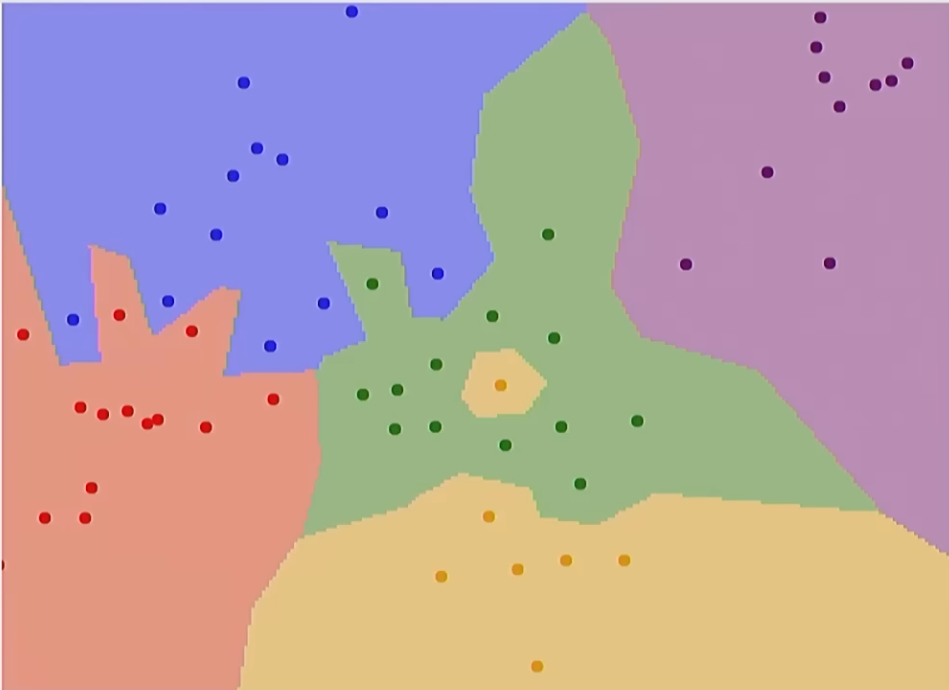
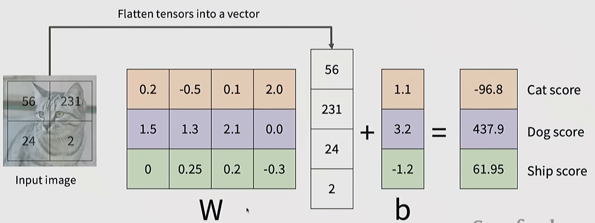
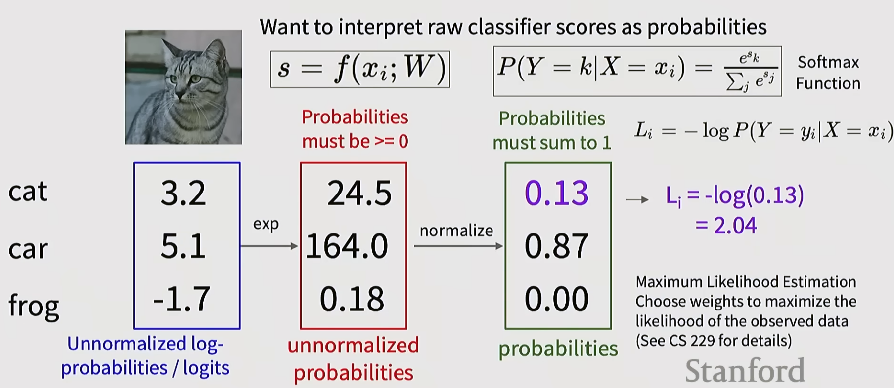

# Lecture 2  Image Classification with Linear Classifiers

## Image Classification  
이미지와 미리 정의된 레이블이 주어졌을 때 시스템의 역할은 해당 이미지에 어떤 레이블 중 하나를 할당하는 것이다.
하지만 인간에게는 쉽지만 컴퓨터에게는 어렵다 왜냐하면 이미지는 수의 나열일 뿐이기 때문이다.  
예시로 고양이가 가만히 있다고 하여도 카메라를 움직이기 때문에 모든 픽셀의 값이 변한다. 하지만 인간에게는 그저 고양이일뿐이다.
조명에 따라서도 같은 물체여도 기계는 조명에 따라 픽셀이 달라서 인식하기에 어려움이 생긴다. 그리고 배경에 따라서도 변한다. 가려짐이 가장 어려운 이슈 중에 하나이다. 형태가 변하는 것도 있다. intraclass variation, context...  
  
image classifier를 만들어보자
이미지를 분류하기 위한 논리와 과정을 미리 정하는 것은 어렵다. 예시로 에지를 검출하고 그에 맞는 알고리즘을 만들어 봤지만 모든 경우에서 분류를 하는 것은 그러한 방법은 성공적이지 못했다.
데이터 기반 관점에서 바라보기로 하였고 3단계 프로세스 절차를 만들어 냈다.
1. 이미지 세트와 레이블을 모은다.
2. 데이터에 있는 이미지와 레이블을 입력 받아 연결할 수 있는 머신러닝 알고리즘을 사용한다
3. 새로운 이미지로 분류기를 평가하는 것이다.

## Nearest Neighbor
def train(images, labels) => memorize all data and labels
def predict(model, test_images) => predict the label of the most similar training image

테스트 이미지와 훈련 이미지 중에서 어떤 것이 유사한지를 확인하는 과정을 진행 하는 것인데 여러 가지 방법 중 L1 거리가 있다. 테스트 이미지와 훈련 이미지의 각각의 원소를 빼고 새로운 행렬에 저장한다. 그 과정이 모두 끝나면 새로운 행렬의 모든 원소를 더한 값을 결과로 한다.  
 
이렇게 하면 결과가 

이런 식으로 나오는데 문제는 가운데 노란색이 가장 가까운 이웃을 하나만 사용하기 때문에 이런 문제가 생긴다. 그래서 새로운 방법으로 여러 이웃을 사용하게 하는 k-NN 방법을 사용하는 것이다. k 개의 가장 가까운 이웃을 조사하고 투표로 정하는 것이다. 물론 이 방식에서는 k의 값도 중요하지만 점간의 거리를 어떻게 정의하는 것도 중요하다 크게 L1(맨하튼) 거리와 L2(유클리드) 거리가 있다. 둘 다 모두 중심점과 모든 점의 거리는 모두 같다는 것이다. 이 둘의 차이는 영상을 회전을 진행하는 등의 무언가 진행하면 L1은 변하지만 L2는 변하지 않는다. 그런데 이런 특징들이 의미 있는 정보를 담고 있는 경우도 있어서 보존하고 싶을 때 L1이 나을 수도 있다 거리를 보존하고 강화하는 형태를 가지기 때문이다.  
그런 이유는 원소의 차이를 단순히 더하기 때문에 개별성을 더 잘 유지시킨다. L1은 중요 하지 않은 요소는 아예 0으로 만들어 노이즈 같은 정보를 무시하고 특징이 뚜렷한 정보를 강조하여 보존한다. 그리고 회전에 대해서는 입력 데이터가 가진 고유한 축 정보를 왜곡하지 않고 유지한다. 그런데 이런 점이 기하학적인 의미를 뜻하지는 않는다. 그리고 생각해야 하는 것은 지금 행렬 차원의 영상 연산의 차이이므로 실제 그래프가 논점이 아닌 것이다.  
http://vision.stanford.edu/teaching/cs231n-demos/knn  

그런데 왜 애초에 가장 가까운 이웃에 대해서 이야기 했을까? 가장 해결하기 쉬운 해결책이기도 하고 데이터 기반 관점에서 가장 적합하다. 하지만 더 중요한 것은 하이퍼파라미터 주제를 볼 수 있다.
하이퍼파라미터는 알고리즘을 실행하기 위해 결정해야 하는 변수들 중 일부이다. k는 그 중에 하나이다. 그리고 거리 함수도 맞다. 그래서 우리는 문제에 맞춰 최적화하기 위한 요소를 식별할 방법을 갖추어야 한다.

### Setting Hyperparameter 
1. 훈련 데이터에 적합한 하이퍼파라미터를 고르는 것이다. k = 1 일 때 항상 최적의 값이 나오기 때문에 좋은 방법이 아니다.
2. 별도의 테스트 세트에서 적합한 하이퍼파라미터를 고르는 것이다. 이는 다른 데이터 포인트에서 맞는지 알 수 없어 좋은 방법이 아니다.
3. 훈련 데이터 일부를 분리하여 검증 데이터로 사용한다. 물론 최선의 방법이지만 검증 데이터가 전체 상황을 대변할 수 없다.
4. 교차 검증, 데이터를 폴드로 나누고 각각의 폴더를 검증하고 결과를 평균낸다. 그런 뒤 테스트를 진행한다.

## Linear Classifier

### Parametric Approch
입력 이미지를 출력 숫자로 매핑하는 몇가지 매개변수 또는 가중치를 학습하고 있다 입력에 대한 결과는 이미지와 10개의 출력 클래스 레이블 각각에 대한 점수와 같은 형태이다. 그래서 f(x, W) = Wx + b 가 이 함수를 표현하면 10x1 mat = 10x? * ? x 1 + 10x1 의 행렬 연산을 하는 것이다. 그리고 10 x ?의 가중치를 구하는 것이다.  
선형 분류기는 선형 함수가 되고 이들이 모여 신경망을 구성하는 것이다. 

여기서 W 값은 템플릿(라벨링 된 것들)에 따라 다르다.

그리고 선형분류기는 이렇게 시각적인 부분도 있지만 기하학적인 관점도 있다. 이 관점에서는 각 템플릿들을 직선을 통하여 다른 클래스와 구분하는 직선을 찾는 역할을 한다.  
문제는 여러 개의 개별 데이터를 한꺼번에 분류할 수 없다는 한계가 있다. 예를 들면 2, 4사분면, 1, 3사분면을 나누거나 동심 원으로 나누어진 영역을 나눌 수는 없다.

그러면 이런 한계에서 템플릿별로 점수로 변환하는 가중치를 어떻게 선택할 것인가? 
1. 분류기가 성능이 얼마나 나쁜지 즉, 훈련데이터 점수에 대한 불만을 정량화 하는 손실 함수를 정의한다. 
2. 손실을 최소화 하는 파라미터를 효율적으로 찾을 수 있는 방법을 고안한다. (최적화)

### Softmax Classifier

원본 점수가 세 개가 있다 그러나 음수가 있으므로 이를 exp()를 통해서 지수화를 해서 양수로 바꾼다 그런 뒤에 정규화를 진행시켜준다. 그럼 확률로서 알 수 있고 확률 함수 L_i를 이용해서 손실 정도를 평가할 수 있다. 이를 통해서 최적화 하면 올바른 w을 구할 수 있다.