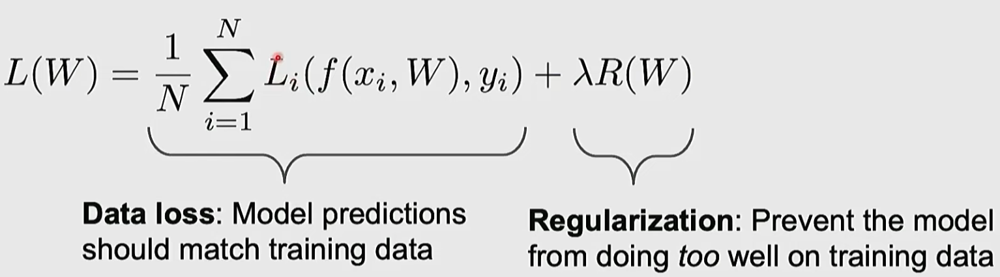

# Lecture 3 Regularization and Optimization

## Regularization

우항은 정규화를 이용해서 훈련데이터에서 너무 성능이 잘 나오지 않도록 조절 해준다. 
그럼 정규화를 하는 이유는 데이터에 지나치게 과적합 되는 것을 방지하고, 데이터에 덜 적합하더라도 더 단순하거나 다른 특성을 가진 모델이 더 나은 선택이 될 수 있다는 직관을 반영한다.  
여기서 람다는 정규화의 강도이며, 모델이 훈련 데이터에 맞춰지는 것을 얼마나 방지할지 결정할 수 있는 조절 장치인 셈이다.  
L1, L2에 대한 내용이 나오는데 이해가 되지 않아 다시 봐야 함 

## Optimization
미분을 통해서 알 수 있는데 다차원 환경에서는 그래디언트를 구해야 한다. 그리고 어떤 기울기와 어떤 방향과 내적을 진행하면 그래디언트의 방향을 알 수 있고 가장 가파른 내리막의 방향은 음의 경사도가 된다.

이러한 경사를 찾기 위해 경사하강법을 배워보자  

SGD